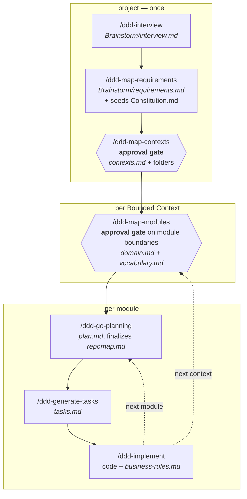

# The dddkit Pipeline

What each skill does, in what order, and which of them you can skip.

`DDD.md` is the constitution — the rules the tree must obey. This file is the
operating manual: it describes the eleven skills in `.claude/skills/` and the
two workflows worth memorizing. Where the two disagree, `DDD.md` wins.

**Naming.** Every skill is prefixed by what it is, so the whole SDK is one tab
completion away and nothing collides with a skill from another framework
installed alongside it:

- **`ddd-`** — you invoke it. All ten pipeline and on-demand skills.
- **`dddintern-`** — the framework invokes it. Internal machinery you normally
  never type; there is currently exactly one,
  `/dddintern-discover-bounded-context`.

Renamed 2026-09-06. `plan/` and `workflow.md` still use the pre-rename names
(`model-context`, `plan-context`, and the unprefixed rest) because they are
historical records of decisions as they were made, and are not retro-edited.

---

## 1. The shape of it

The pipeline is not one straight line, which is the usual source of confusion.
It has three tiers, and the tier is what tells you how often a skill runs:

| Tier | Runs | Skills |
|---|---|---|
| **Project** | Once per project | `/ddd-interview` → `/ddd-map-requirements` → `/ddd-map-contexts` |
| **Context** | Once per Bounded Context | `/ddd-map-modules` |
| **Module** | Once per module, repeated | `/ddd-go-planning` → `/ddd-generate-tasks` → `/ddd-implement` |

So a project with two Bounded Contexts holding three modules each runs the first
tier once, the second tier twice, and the third tier six times.




Two skills are absent from that diagram on purpose. `/dddintern-discover-bounded-context`
is machinery — four other skills call it to resolve their target module rather
than re-deriving paths themselves. `/ddd-checklist` and `/ddd-implement-progress` are
tools you reach for when you want them, not steps you pass through.

---

## 2. The minimum workflow

Seven commands, nothing optional, from an empty repo to running code:

```
/ddd-interview            what are we building?
/ddd-map-requirements     turn that into FR-###/NFR-###  (also seeds Constitution.md)
/ddd-map-contexts         propose Bounded Contexts → you approve → folders created
/ddd-map-modules        propose modules → you approve → domain.md + vocabulary.md
/ddd-go-planning         technical plan; repomap.md's code_glob is decided here
/ddd-generate-tasks       tasks.md, ordered, grouped by Aggregate
/ddd-implement            real code + business-rules.md beside it
```

**None of the seven can be dropped**, and the reason is worth knowing: each
refuses to run without the previous one's output. `/ddd-map-contexts` refuses
without *both* `interview.md` and `requirements.md`. `/ddd-go-planning` refuses
without `domain.md` and `vocabulary.md`. `/ddd-implement` refuses without `tasks.md`
and a finalized `repomap.md`. The pipeline enforces its own order — you cannot
get ahead of it by accident.

The last three repeat per module. If a Bounded Context has three modules, run
`/ddd-map-modules` once for the context (it offers batch mode across all three),
then the `/ddd-go-planning` → `/ddd-generate-tasks` → `/ddd-implement` trio three times.

---

## 3. The complete workflow

The minimum, plus everything that exists for when a project is bigger than a
weekend:

```
/ddd-interview                      … repeat later to add ground; appends a Round, never rewrites
/ddd-map-requirements               … re-run to add requirements; IDs continue, never renumber
/ddd-constitution                   ← amend the principles /ddd-map-requirements seeded
/ddd-checklist                      ← e.g. "testability of the requirements"  (project-wide)
/ddd-map-contexts                   ← re-run later to add a context, or reconcile drift

  for each Bounded Context:
    /ddd-map-modules              … batch mode walks every module in the context

      for each module:
        /ddd-go-planning
        /ddd-checklist              ← e.g. "security of the orders module"  (module-scoped)
        /ddd-generate-tasks
        /ddd-implement              ← creates roadmap.md if tasks.md is too big for one session
        /ddd-implement-progress     ← read-only: where does this module stand?
        /ddd-implement              ← next roadmap phase
```

`/dddintern-discover-bounded-context` can be run directly when you just want to know where
a module lives, but you normally never type it.

---

## 4. The eleven skills

### Pipeline skills

**`/ddd-interview`** — Free-form capture of what you want to build, in your own
words, into `specs/Brainstorm/interview.md`. Deliberately unstructured: it is
not the place for testable requirements (`/ddd-map-requirements`) or context names
(`/ddd-map-contexts`, which `DDD.md` §4 forbids inferring here). Re-running appends
a dated `## Round N`; a prior round is never rewritten. No prerequisites.

**`/ddd-map-requirements`** — Turns that into numbered, testable `FR-###`/`NFR-###`
in `specs/Brainstorm/requirements.md`. Prefers documenting an **Assumption** over
asking, and is capped at three `[NEEDS CLARIFICATION]` markers per run. On its
first run only, it also seeds `specs/Constitution.md` from whatever durable,
project-wide principles surfaced; after that the file is `/ddd-constitution`'s alone.
Reads `interview.md` if present but can run standalone — though `/ddd-map-contexts`
needs both, so skipping `/ddd-interview` only defers the work.

**`/ddd-map-contexts`** — Proposes the project's Bounded Contexts, **waits for your
explicit approval**, then writes `specs/BoundedContexts/contexts.md` and creates
the context folders. The highest-blast-radius skill in the SDK, and the most
constrained one: every write is approval-gated, and once a context exists this
skill will only ever *add*. It never renames, merges, or deletes one — that is a
manual migration, on purpose. Refuses to run without both `interview.md` and
`requirements.md`.

**`/ddd-map-modules`** — For one Bounded Context, proposes its module boundaries
(one module per aggregate root, DDD's own heuristic), waits for approval, then
runs `scaffold-context.py` per approved module and fills in `domain.md` and
`vocabulary.md`. It deliberately leaves `repomap.md` a skeleton: *where* the code
goes is a technical decision and belongs to the next skill. Offers batch mode to
walk every module in the context in one session. Runs `build-index.py` at the end.

**`/ddd-go-planning`** — For one module: the technical plan (`plan.md`), and the
decision this whole pipeline has been deferring — `repomap.md`'s `code_glob` and
`module_kind`, which is what binds the spec to a real path. Runs a Constitution
Check twice, before and after drafting, against both `specs/Constitution.md` and
`DDD.md` §3; a violation must be either resolved or justified in the plan's
Complexity Tracking table, never silently passed. Runs `build-index.py`.

**`/ddd-generate-tasks`** — Breaks `plan.md` into `tasks.md`: dependency-ordered,
`[P]`-marked where parallel-safe, with **one phase per Aggregate** from
`domain.md` — not per user story, because a dddkit module is DDD-modeled, not
feature-branch-shaped. Every task carries a concrete path, and every Aggregate
phase carries a task for the business-rule file.

**`/ddd-implement`** — Executes `tasks.md`: real code, at the path `repomap.md`
resolves to, with `business-rules.md` written *in the same pass* as the code it
documents — never deferred to a cleanup task. Gates on any unchecked item in the
module's `checklists/` (it stops and asks; it never checks a box itself). Creates
`roadmap.md` if `tasks.md` is too large for one session, then works one phase per
run. Ends by running `validate-ddd.py`; a failure blocks calling the module done.

### On-demand tools

**`/ddd-constitution`** — Creates or amends `specs/Constitution.md`, the project's
own engineering principles. Strictly scoped: it never touches `.dddkit/DDD.md`,
which is the *framework's* constitution and is governed separately. Handles its
own SemVer bump and Sync Impact Report. Usable at any point.

**`/ddd-checklist`** — Generates a custom, falsifiable review checklist against the
real current content of a target — module-scoped (`<module>/checklists/<name>.md`)
or project-wide (`specs/checklists/<name>.md`). Reviewer-owned: this skill writes
items and never checks one. `/ddd-implement` reads them as a gate, which is what makes
a checklist worth writing.

**`/ddd-implement-progress`** — Read-only status for one module: task tally per phase,
roadmap phase table if there is one, and whether the business-rule file actually
exists. Writes nothing, ever.

### Internal

**`/dddintern-discover-bounded-context`** — Resolves a module reference (uuid,
`Context/module`, or a bare module name) to its full file set: spec folder,
`domain.md`, `vocabulary.md`, `repomap.md`'s pointer, resolved `code_path`, and
the expected business-rule-file path. `/ddd-go-planning`, `/ddd-generate-tasks`,
`/ddd-implement`, and `/ddd-implement-progress` all call it instead of re-deriving paths,
so path logic lives in exactly one place. Read-only, apart from rebuilding the
index when it finds it stale. Never guesses between ambiguous matches.

---

## 5. Where everything lands

| Artifact | Written by | Then read by |
|---|---|---|
| `specs/Brainstorm/interview.md` | `/ddd-interview` | `/ddd-map-requirements`, `/ddd-map-contexts` |
| `specs/Brainstorm/requirements.md` | `/ddd-map-requirements` | `/ddd-map-contexts`, `/ddd-generate-tasks` (for `(FR-###)` tags) |
| `specs/Constitution.md` | `/ddd-map-requirements` (seed), then `/ddd-constitution` | `/ddd-go-planning`, `/ddd-generate-tasks` |
| `specs/BoundedContexts/contexts.md` | `/ddd-map-contexts` | `/ddd-map-contexts` re-runs; linter check 3 |
| `<module>/domain.md` | `/ddd-map-modules` | everything downstream; owns the `uuid` |
| `<module>/vocabulary.md` | `/ddd-map-modules` | humans, mostly |
| `<module>/repomap.md` | `/ddd-map-modules` (skeleton) → `/ddd-go-planning` (finalized) | `/ddd-generate-tasks`, `/ddd-implement`, both linters |
| `<module>/plan.md` | `/ddd-go-planning` | `/ddd-generate-tasks`, `/ddd-implement` |
| `<module>/tasks.md` | `/ddd-generate-tasks` | `/ddd-implement`, `/ddd-implement-progress` |
| `<module>/roadmap.md` | `/ddd-implement`, only when needed | `/ddd-implement`, `/ddd-implement-progress` |
| `<module>/checklists/*.md` | `/ddd-checklist` | `/ddd-implement` (as a gate) |
| `<code path>/business-rules.md` | `/ddd-implement` | humans reading the code; both linters |
| `.dddkit/index.json` | `build-index.py` | `/dddintern-discover-bounded-context` |

---

## 6. Where it stops and asks you

Four places, and they are the framework's design, not friction to route around:

1. **`/ddd-map-contexts` will not write anything without explicit approval.**
   Mandated by `DDD.md` §4 — an LLM is forbidden from inferring Bounded Contexts.
2. **`/ddd-map-modules` proposes module boundaries and waits.** Aggregate
   boundaries are a design decision, not a naming exercise.
3. **`/ddd-implement` stops on an unchecked checklist item** and asks whether to
   proceed anyway.
4. **`/ddd-go-planning`'s Constitution Check** must be resolved or explicitly
   justified in Complexity Tracking.

Everything else refuses on a *missing prerequisite* rather than asking — it tells
you which skill to run first.

---

## 7. The scripts underneath

Skills are prose an agent follows; these are deterministic and are what the
framework actually trusts.

| Script | Run by | Does |
|---|---|---|
| `scaffold-context.py` | `/ddd-map-modules` | Creates a module folder and assigns its `uuid`. The single source of truth for both — never hand-roll them. |
| `build-index.py` | `/ddd-map-modules`, `/ddd-go-planning` | Rebuilds `.dddkit/index.json`, the `uuid` → path cache. |
| `validate-ddd.py` | `/ddd-implement` | The five-check linter. A failure blocks "done". |
| `generate-manifest.py` | you, by hand | Regenerates the integrity manifests. **Required after editing anything under `.dddkit/` or `.claude/skills/`**, or `validate-ddd.py` fails on a hash mismatch. |
| `dddkit check` (Rust) | you, by hand | Same three concerns, uuid-first, with a `Pending`/`Fixable`/`Failure` severity ladder and `--fix`. See `linter/README.md` for the deliberate divergences. |

---

## 8. Re-running things

Every pipeline skill is safe to re-run; none of them destroys prior work. What
differs is what a re-run *means*:

- `/ddd-interview` appends a Round. `/ddd-map-requirements` continues the `FR-###`
  numbering. Neither ever rewrites an existing entry.
- `/ddd-map-contexts` is additive only — it will not rename or remove a context.
- `/ddd-map-modules` skips modules that already exist rather than re-scaffolding
  them (a `uuid` is assigned once and never reassigned).
- `/ddd-go-planning` re-run on an already-finalized `repomap.md` is a **MAJOR**
  bump with a Sync Impact Report — you are moving code that already exists.
- `/ddd-implement` picks up at the next unchecked task, or the next roadmap phase.
